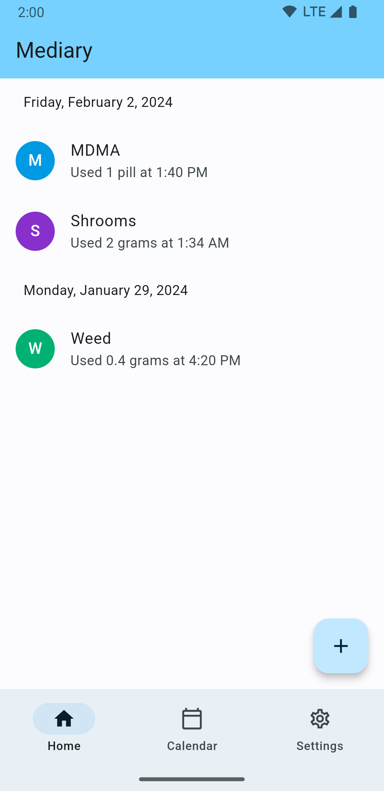
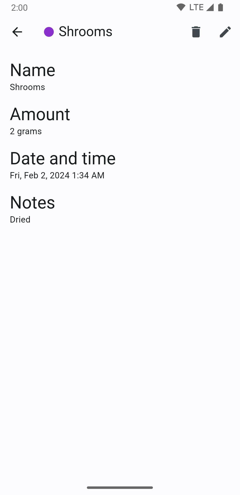
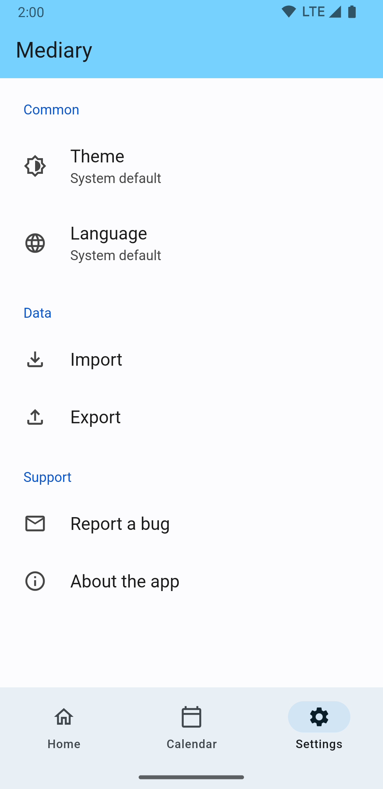

# </img> Mediary

Track drug usage without judgement.

## Description

**Note that the author of this app does not condone the use of illicit drugs.** This app is intended to be used by people who are already using them, and want to track their usage and make informed decisions about their drug use.

Mediary (pronounced med-diary, or just mediary) is an app that allows users to track their drug usage. You can log the name, the amount, and the time and date of use. It is also possible to attach a note to a log entry. You can view entries in a list and calendar view.

## Screenshots

    </img>
    </img>
    </img>
    </img>

## Installing

* Download the appropiate APK for your device from the [releases page](https://github.com/2zqa/mediary/releases). If you're unsure, pick **app-arm64-v8a-release.apk**.
* If prompted, give permission to install from unknown sources.
* Google Play Protect will warn you that the author of the app is not verified. You can ignore this warning by clicking **Details** and then **Install Anyway**.

## Help and feedback

If you run into any problems, or have a suggestion for a new feature, please first check if someone else has already reported/suggested it in the [issues page](https://github.com/2zqa/mediary/issues). If not, feel free to open a new issue.

## Building from source

### Prerequisites

* Flutter >= 3.13.5
* Dart >= 3.1.2
* Java >= 17

A full tutorial on how to get started with Flutter is available at https://docs.flutter.dev/get-started/install

### Building

* Clone and open this repository: `git clone https://github.com/2zqa/mediary.git && cd mediary`
* Run `flutter pub get`
* (Optional) Setup a keystore for signing the app. You can follow [this guide](https://docs.flutter.dev/deployment/android#signing-the-app) to do so.
* Run `flutter build apk --split-per-abi`

## Contributing

Thanks for considering contributing! To get started:

1. Create an issue describing what you want to change
2. Fork this repository and clone it
3. Make your changes
4. Submit a pull request, referencing the issue you created with "Closes \#\<issue-number\>" in the description

## License

Mediary is licensed under the [GNU GPLv3](LICENSE) license.
